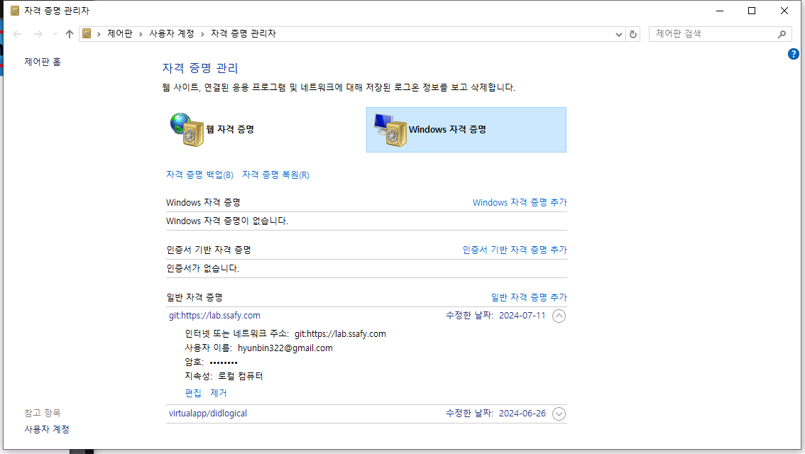

# 3일차



자리 바뀌면 이거 확인해야 함


## 로컬 -> 원격 저장소

- 경로 설정

```sh
git remote add origin https://github.com/HyunbeenLim/start_camp.git
```

- 커밋 보내기
```sh
git push -u origin 
```

##  원격 저장소 -> 로컬

```sh
git pull remote_repo_url
```

```sh
git clone remote_repo_url
# 강의장 -> 깃헙 -> 집에서 유용함. 모든 기록, 파일 가져와줌
```

### 집에서 한다는 가정 실험

- clone 으로 깃허브에서 다 불러오기(처음에만)
- 집에서 수정 후 다시 push하기


### 다시 강의장에서

- pull로 불러오기
- 다시 push
